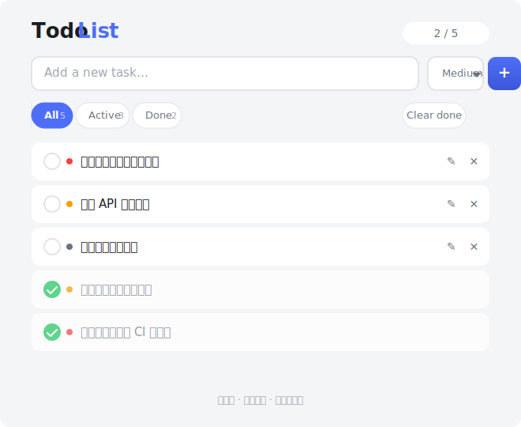
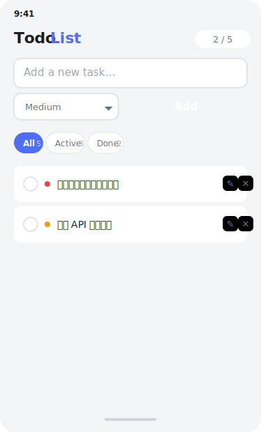

 # Todo List
 
 
 
 一个简洁、响应式的待办事项（Todo List）应用，使用原生 HTML + CSS + JavaScript 构建，所有数据存储在浏览器的 **LocalStorage** 中，无需后端服务。
 
 ## 功能特性
 
 | 功能 | 说明 |
 |------|------|
 | **添加任务** | 输入任务内容并选择优先级（High / Medium / Low）后一键添加 |
 | **标记完成** | 点击圆形复选框切换任务的完成状态，已完成项自动置灰并带删除线 |
 | **编辑任务** | 点击编辑图标就地修改任务文本，Enter 确认，Esc 取消 |
 | **删除任务** | 点击删除按钮移除单个任务 |
 | **筛选视图** | 通过 **All / Active / Done** 三个筛选按钮快速切换视图，每个按钮旁显示对应数量 |
 | **批量清除** | "Clear done" 一键清空所有已完成任务 |
 | **优先级标记** | 每个任务前以彩色圆点标识优先级：红色（高）、黄色（中）、灰色（低） |
 | **本地持久化** | 所有任务自动保存到浏览器的 LocalStorage，关闭页面后数据不丢失 |
 | **响应式设计** | 桌面端与移动端自适应布局 |
 
 ## 技术栈
 
 - **HTML5** — 语义化结构
 - **CSS3** — Flexbox 布局、CSS 自定义属性（变量）、过渡动画
 - **JavaScript (ES6+)** — 事件委托、模版字符串、LocalStorage API
 - 无外部依赖、无构建工具、无需安装
 
 ## 快速开始
 
 直接在浏览器中打开 `index.html` 即可使用：
 
 ```bash
 # 克隆仓库后直接打开
 git clone https://github.com/toygreen/codex_01.git
 cd codex_01
 start index.html
 ```
 
 也可将 `index.html` 拖入浏览器窗口或使用本地 HTTP 服务器：
 
 ```bash
 # Python 快速启动
 python -m http.server 8000
 # 然后访问 http://localhost:8000
 ```
 
 ## 使用指南
 
 1. 在输入框中填写任务描述，选择优先级，点击 **Add**
 2. 点击任务左侧的圆形复选框标记完成
 3. 点击 ✎ 图标进入编辑模式，按 Enter 保存、Esc 取消
 4. 使用顶部筛选器切换视图，点击 **Clear done** 批量清理
 
 ## 响应式布局
 
 
 
 应用在小屏幕设备上自动适配布局：输入框换行排列、按钮自适应宽度、间距优化，确保在手机上也有良好的操作体验。
 
 ## 项目结构
 
 ```
 codex_01/
 ├── index.html          # 单页面应用（含完整 HTML/CSS/JS）
 ├── screenshots/
 │   ├── app-preview.svg       # 桌面端预览
 │   └── mobile-preview.svg    # 移动端预览
 ├── .gitignore
 └── README.md
 ```
 
 ## License
 
 MIT
